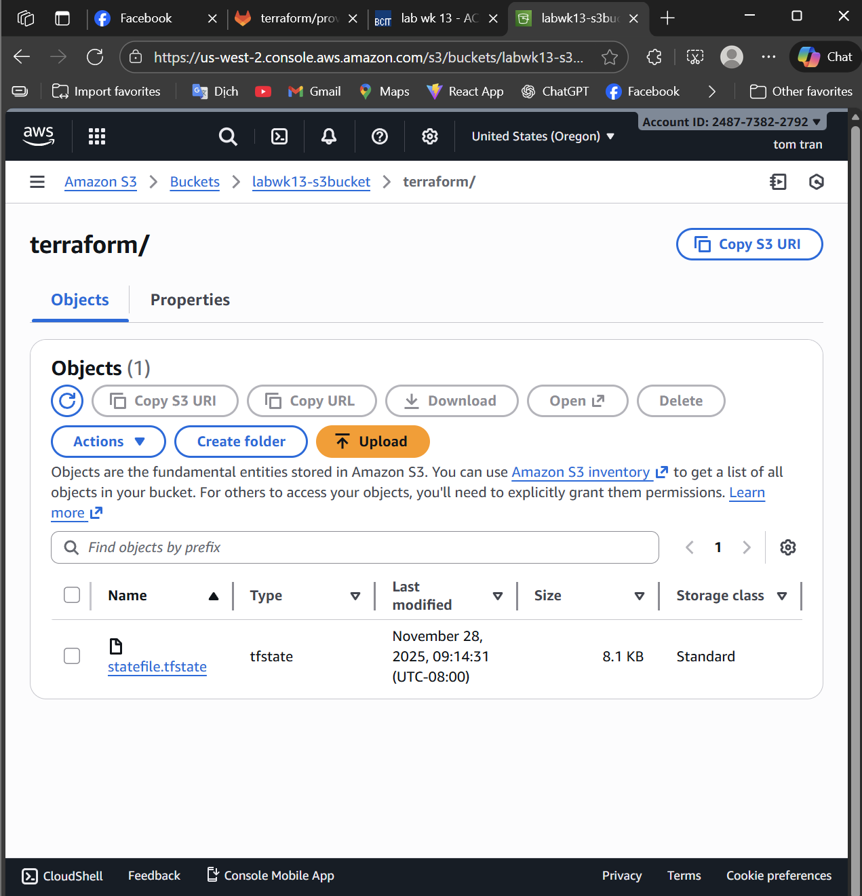
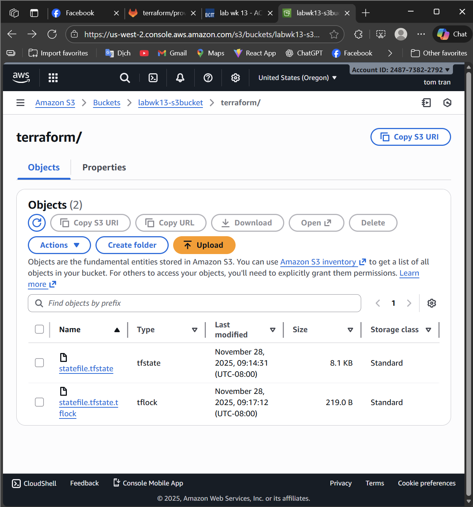

# terraform-s3-backend-lab

When is the state file created?

The state file is created after running terraform apply for the first time, once Terraform provisions resources and needs to record their real-world configuration in the backend.
---

When is the lock file present?

The lock file (.terraform.tfstate.lock.info) is present only while Terraform is performing a write operation such as:

terraform apply

terraform refresh

terraform destroy

It prevents simultaneous state modifications.
---

Is the lock file always in the bucket after it is created?

No.
The lock file is temporary.
Terraform automatically deletes it once the operation finishes.

## State File Screeshot

## Lock File Screenshot

